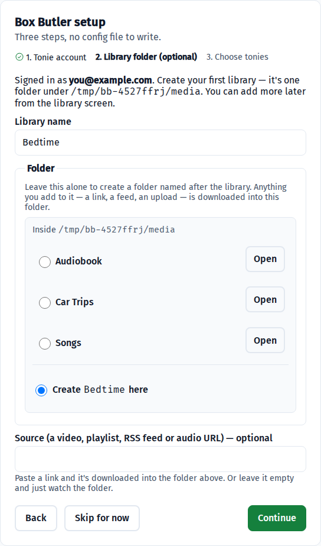
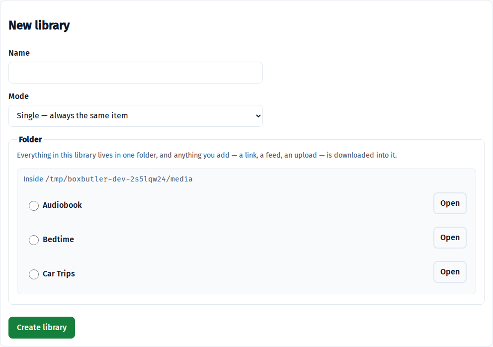
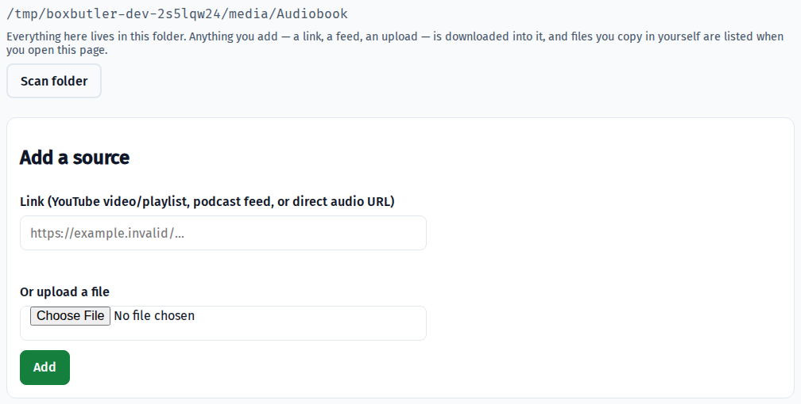

# Box Butler

**Manage what's on your Toniebox Creative-Tonies.**

Build libraries from your own audio — a folder of files, a podcast feed, a YouTube playlist, an
upload — then choose, per tonie, what goes on it and whether it changes: a fresh story each night, a
fixed set that stays put, an audiobook across nights, or one story on repeat. Self-hosted, one
container, no app fiddling at bedtime.

> [!IMPORTANT]
> Unofficial tool, **not associated with Boxine GmbH** ("tonies", "Toniebox" and "Creative-Tonie"
> are their trademarks). It uses an API that is **neither public nor supported**, so it can break
> without notice and **your account could in principle be restricted**. See
> [Disclaimer](#disclaimer) before installing.


## A tonie never ends up empty

```
PLAN → FETCH → RENDER → VERIFY → SNAPSHOT → CLEAR → UPLOAD → SETTLE → COMMIT
```

The first four steps don't touch the tonie. **Stage, verify, then swap**: it is never cleared until
the replacement is downloaded, trimmed and verified — so a failed download or a dead network leaves
last night's story in place. If a swap fails midway the tonie is marked `DEGRADED` and the next run
repairs it before rotating anything new. Every swap writes a write-once snapshot of what was there
first.

> [!NOTE]
> Box Butler changes what is **in the cloud**. Your Toniebox plays from its own storage and picks
> changes up when it next checks — switch a box on with the tonie already on it and you may hear the
> old story. Lifting the tonie off and putting it back makes it fetch the new one.
> [More on this →](docs/GUIDE.md#the-box-may-still-play-the-old-story)


## What a tonie can do

Each tonie gets a library and one behaviour. That choice is the whole product:

| Behaviour | What goes on the tonie | Changes by itself? |
|---|---|---|
| `single` | One item, trimmed to fit | Yes — a new one each run |
| `album` | The whole library, as chapters | No |
| `serial` | Fills to the cap, continues where it left off next time | Yes — works through it |
| *Always play this one* | Exactly the item you choose | No — until you change it |

**[Worked examples → docs/GUIDE.md](docs/GUIDE.md)** — a story a night, a fixed album for the car, an
audiobook over two weeks, and one favourite that never changes.

## Features

- **A library is a folder** — copy files in yourself, or paste a YouTube video, playlist, podcast
  feed or direct audio URL and it's downloaded into that same folder.
- **Shuffle or ordered**, **duplicate avoidance** across tonies, and a repeat cooldown.
- **Prefetch**, so a broken extractor doesn't cost you the night it breaks.
- **Web UI, CLI and Prometheus metrics** — dry-run is the default everywhere; writing needs `--apply`.


## Quick start

**`compose.yml`** — the whole thing:

```yaml
services:
  box-butler:
    image: ghcr.io/the-kizz/box-butler:0.1.4
    container_name: box-butler
    restart: unless-stopped
    ports:
      - "8410:8410"
    environment:
      - TZ=Australia/Melbourne      # your zone — don't leave this at UTC
      - PUID=1000
      - PGID=1000
    env_file: .env
    volumes:
      - ./data:/data                # SQLite + snapshots — the bit worth backing up
      - ./cache:/cache              # downloaded audio — large, rebuilds itself
      - /path/to/media:/media       # required: your own audio — read-write, see below
```

**`.env`** beside it — two values are all you need:

```ini
BOXBUTLER_SINK_USER=you@example.com
BOXBUTLER_SINK_PASSWORD=your-tonies-password
```

```bash
docker compose up -d
```

Or without compose, to try it:

```bash
docker run -d --name box-butler -p 8410:8410 \
  -e TZ=Australia/Melbourne \
  -e BOXBUTLER_SINK_USER=you@example.com \
  -e BOXBUTLER_SINK_PASSWORD=your-tonies-password \
  -v "$PWD/data:/data" -v "$PWD/cache:/cache" -v "$PWD/media:/media" \
  ghcr.io/the-kizz/box-butler:0.1.4
```

### About `/media`

**A library is exactly one folder.** Like Plex and the \*arr stack, Box Butler's libraries are
directories: content arrives in them however you like, and the app reads what is there. Adding a
YouTube link, a playlist, a podcast feed or an upload *downloads the audio into that folder* — after
which it is an ordinary file, indistinguishable from one you copied in yourself.

That means `/media` is mounted read-write, so it is worth being precise about what Box Butler will
and will not do in there:

- It **only ever creates new files.**
- It **never modifies, renames, moves, truncates or deletes a file it did not create.**
- A filename collision picks a **different name** — never an overwrite.
- Removing an item from a library removes the database row. The file on disk is deleted only if you
  explicitly tick "and delete the file".
- Retention/eviction only ever prunes `/cache`. No cache budget can shrink a library folder.
- `/media` is **not** chowned on startup — it is your media, not the app's. Set `PUID`/`PGID` to a
  uid that can already write to it.

Box Butler refuses to start if `/media` is missing or unwritable, naming the mount. There is
deliberately no fallback into `/data`: that is the volume you back up, and libraries hold hours of
audio.

### Getting audio into a library

Open `http://localhost:8410` and the three-step wizard picks the folder for you — browse what's
already under `/media`, or let it create one named after the library. Every step can be skipped if
you already have what it makes.



Afterwards, **Libraries → New library** does the same thing:



Then fill it, either way round:

- **Copy files in yourself** — `cp`, `rsync`, Samba, your \*arr stack, anything. Opening the library
  page scans its folder first, so what you copied in is already listed; there's a **Scan folder**
  button for a deliberate re-check. (Scan-on-open rather than a filesystem watcher, deliberately:
  inotify doesn't work on NFS or SMB, so a watcher would look like it worked and quietly do nothing
  on a network share.)
- **Paste a link or upload** — a YouTube video or playlist, a podcast feed, a direct audio URL. The
  audio is **downloaded into that same folder**, after which it's an ordinary file you can see, move
  and back up yourself.



Assign the library to a tonie and you're done. Nothing touches a tonie until you ask:
`boxbutler run` prints the plan and exits, `boxbutler run --apply` is the one that acts.

## Configuration

Credentials come from environment variables only — never from a config file, so a password left in
`config.yml` is ignored rather than quietly honoured.

| Variable | Required | What it is |
|---|---|---|
| `BOXBUTLER_SINK_USER` | **yes** | Your tonies account email |
| `BOXBUTLER_SINK_PASSWORD` | **yes** | Your tonies account password |
| `BOXBUTLER_SECRET_KEY` | no | Signs session cookies. Omit it and one is generated on first start and stored in the data volume (`/data/secret_key`), so it survives restarts; set it yourself only if you want to manage it |
| `BOXBUTLER_ADMIN_USER` | no | Seeds the web login; omit both and the first-run wizard creates it |
| `BOXBUTLER_ADMIN_PASSWORD` | no | As above |
| `BOXBUTLER_NOTIFY_TOKEN` | no | Bearer token, only if your ntfy server needs one |
| `TZ` | no | Your timezone. Don't leave it at UTC — see the notes |
| `BOXBUTLER_DATA_DIR` | no | Default `/data` |
| `BOXBUTLER_CACHE_DIR` | no | Default `/cache` |
| `BOXBUTLER_MEDIA_ROOT` | **yes** (as a mount) | Default `/media`. Every library is one folder under it, so Box Butler refuses to start without it — and it is read-write |

Everything else — schedule, duration cap, cache budget, prefetch depth, duplicate rules,
notifications — lives in `config.yml` or the Settings screen and applies on the next run, no restart.


**[Environment variables, settings defaults, CLI reference and exit codes →](docs/CONFIGURATION.md)**
· [`config.example.yml`](config.example.yml)
· [Notes on the awkward parts →](docs/NOTES.md) — the pinned YouTube format and `yt-dlp-ejs` solver,
why loudness normalisation defaults to off for bedtime audio, and the measured cloud limits.

## Development

```bash
pytest -q             # the suite; ffmpeg tests are skipped by default
pytest -m ffmpeg      # the ones needing real ffmpeg/ffprobe
make css              # rebuild the stylesheet
```

No test touches the network, the cloud or a real tonie.

## Status

Complete and tested, and proven end to end against real Creative-Tonies — staged, verified,
snapshotted, cleared, uploaded and settled an 89-minute story, then correctly did nothing on a second
run. Still young: treat the first release accordingly.

## Disclaimer

Box Butler is unofficial and independently built. It is **not associated with, endorsed by, or
supported by Boxine GmbH**; "tonies", "Toniebox" and "Creative-Tonie" are Boxine's trademarks.

It talks to the same cloud API the official app uses. That API is **not documented or offered for
third-party use**: it can change without notice, using it may be contrary to the service's terms, and
**your account could in principle be restricted or suspended**. That trade-off is yours to accept.

Nothing here circumvents payment, DRM or account controls — it automates what an owner can already do
by hand in the official app, with content they already have.

## Licences

MIT — see [LICENSE](LICENSE). **ffmpeg is GPL**: it is invoked as a subprocess and never linked, so
the GPL covers the `ffmpeg`/`ffprobe` binaries an image bundles, not this source. Full list, including
`yt-dlp` (Unlicense), `yt-dlp-ejs`, `tonie-api`, Fira fonts and HTMX, in
[THIRD_PARTY_LICENCES.md](THIRD_PARTY_LICENCES.md).

---

<sub>Built with the help of Claude (Anthropic).</sub>
