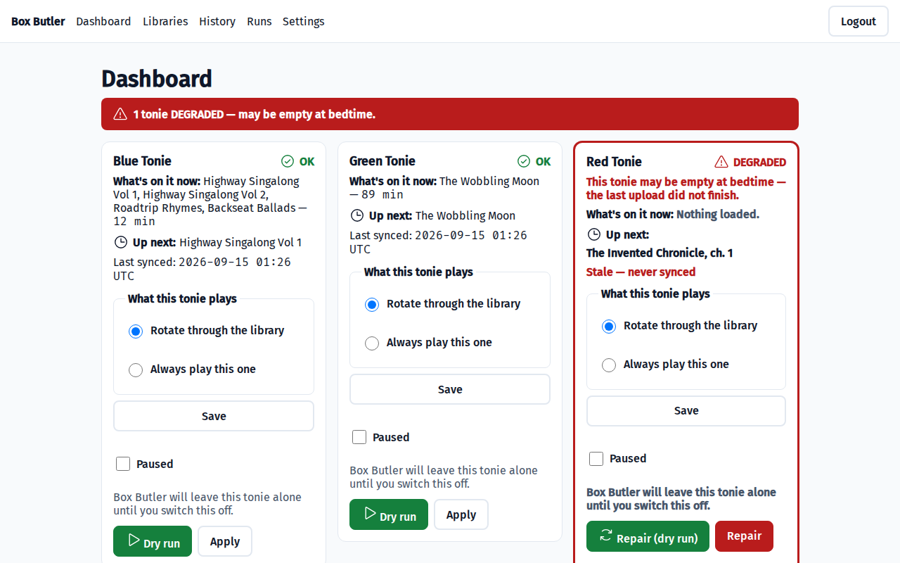
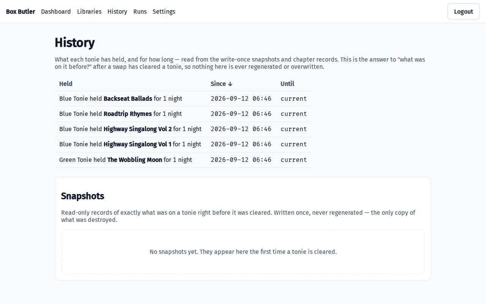
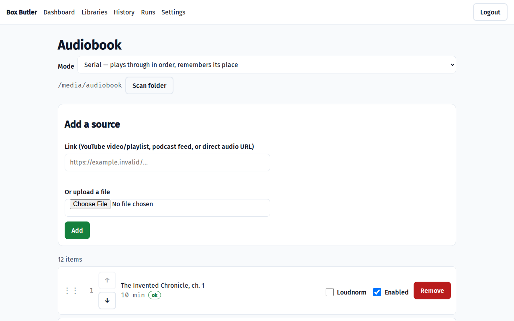
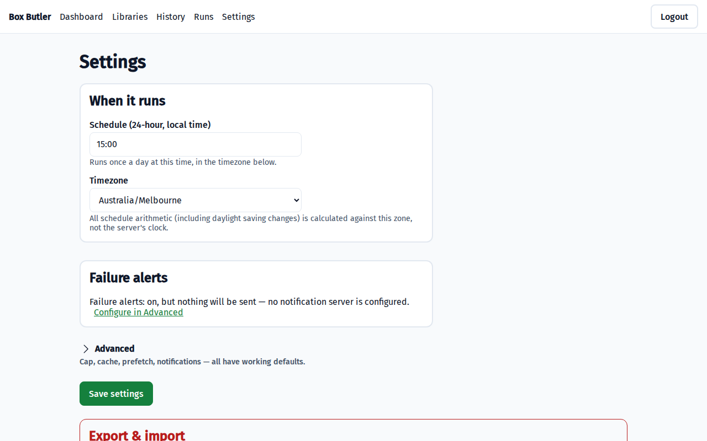

# Box Butler

**Manage what's on your Toniebox Creative-Tonies.**

Build libraries from your own audio — a folder of files, a podcast feed, a YouTube playlist, an
upload — then choose, per tonie, what goes on it and whether it changes: a fresh story each night, a
fixed set that stays put, an audiobook across nights, or one story on repeat. Self-hosted, one
container, no app fiddling at bedtime.

> [!IMPORTANT]
> Unofficial tool, **not associated with Boxine GmbH** ("tonies", "Toniebox" and "Creative-Tonie"
> are their trademarks). It uses an API that is **neither public nor supported**, so it can break
> without notice and **your account could in principle be restricted**. See
> [Disclaimer](#disclaimer) before installing.



## A tonie never ends up empty

```
PLAN → FETCH → RENDER → VERIFY → SNAPSHOT → CLEAR → UPLOAD → SETTLE → COMMIT
```

The first four steps don't touch the tonie. **Stage, verify, then swap**: it is never cleared until
the replacement is downloaded, trimmed and verified — so a failed download or a dead network leaves
last night's story in place. If a swap fails midway the tonie is marked `DEGRADED` and the next run
repairs it before rotating anything new. Every swap writes a write-once snapshot of what was there
first.

> [!NOTE]
> Box Butler changes what is **in the cloud**. Your Toniebox plays from its own storage and picks
> changes up when it next checks — switch a box on with the tonie already on it and you may hear the
> old story. Lifting the tonie off and putting it back makes it fetch the new one.
> [More on this →](docs/GUIDE.md#the-box-may-still-play-the-old-story)



## What a tonie can do

Each tonie gets a library and one behaviour. That choice is the whole product:

| Behaviour | What goes on the tonie | Changes by itself? |
|---|---|---|
| `single` | One item, trimmed to fit | Yes — a new one each run |
| `album` | The whole library, as chapters | No |
| `serial` | Fills to the cap, continues where it left off next time | Yes — works through it |
| *Always play this one* | Exactly the item you choose | No — until you change it |

**[Worked examples → docs/GUIDE.md](docs/GUIDE.md)** — a story a night, a fixed album for the car, an
audiobook over two weeks, and one favourite that never changes.

## Features

- **Six ways in** — YouTube video or playlist, podcast RSS, upload, a watched folder, direct URL.
- **Shuffle or ordered**, **duplicate avoidance** across tonies, and a repeat cooldown.
- **Prefetch**, so a broken extractor doesn't cost you the night it breaks.
- **Web UI, CLI and Prometheus metrics** — dry-run is the default everywhere; writing needs `--apply`.



## Quick start

```bash
mkdir box-butler && cd box-butler
curl -fsSLO https://raw.githubusercontent.com/the-kizz/box-butler/main/compose/box-butler.yml
curl -fsSLO https://raw.githubusercontent.com/the-kizz/box-butler/main/compose/box-butler.env.example
cp box-butler.env.example .env
docker compose -f box-butler.yml up -d
```

```ini
BOXBUTLER_SINK_USER=you@example.com     # your tonies account
BOXBUTLER_SINK_PASSWORD=
BOXBUTLER_SECRET_KEY=                   # any long random string
# BOXBUTLER_ADMIN_USER / BOXBUTLER_ADMIN_PASSWORD optional — leave unset and
# the first-run wizard creates the account
# BOXBUTLER_NOTIFY_TOKEN=               # only if your ntfy server needs one
```

Open `http://localhost:8410`, finish the wizard, add a library, assign it to a tonie. `boxbutler run`
prints the plan and exits; `boxbutler run --apply` is the one that acts.

## Configuration

Credentials come from environment variables only. Everything else — schedule, timezone, duration cap,
cache budget, prefetch depth, duplicate rules, notifications — lives in `config.yml` or the Settings
screen and applies on the next run, no restart.



**[Environment variables, settings defaults, CLI reference and exit codes →](docs/CONFIGURATION.md)**
· [`config.example.yml`](config.example.yml)
· [Notes on the awkward parts →](docs/NOTES.md) — the pinned YouTube format and `yt-dlp-ejs` solver,
why loudness normalisation defaults to off for bedtime audio, and the measured cloud limits.

## Development

```bash
pytest -q             # the suite; ffmpeg tests are skipped by default
pytest -m ffmpeg      # the ones needing real ffmpeg/ffprobe
make css              # rebuild the stylesheet
```

No test touches the network, the cloud or a real tonie.

## Status

Complete and tested, and proven end to end against real Creative-Tonies — staged, verified,
snapshotted, cleared, uploaded and settled an 89-minute story, then correctly did nothing on a second
run. Still young: treat the first release accordingly.

## Disclaimer

Box Butler is unofficial and independently built. It is **not associated with, endorsed by, or
supported by Boxine GmbH**; "tonies", "Toniebox" and "Creative-Tonie" are Boxine's trademarks.

It talks to the same cloud API the official app uses. That API is **not documented or offered for
third-party use**: it can change without notice, using it may be contrary to the service's terms, and
**your account could in principle be restricted or suspended**. That trade-off is yours to accept.

Nothing here circumvents payment, DRM or account controls — it automates what an owner can already do
by hand in the official app, with content they already have.

## Licences

MIT — see [LICENSE](LICENSE). **ffmpeg is GPL**: it is invoked as a subprocess and never linked, so
the GPL covers the `ffmpeg`/`ffprobe` binaries an image bundles, not this source. Full list, including
`yt-dlp` (Unlicense), `yt-dlp-ejs`, `tonie-api`, Fira fonts and HTMX, in
[THIRD_PARTY_LICENCES.md](THIRD_PARTY_LICENCES.md).

---

<sub>Built with the help of Claude (Anthropic).</sub>
