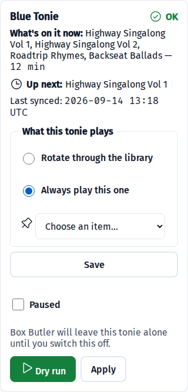
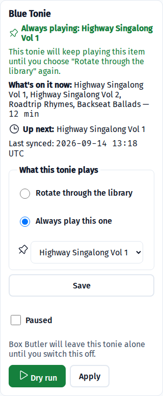

# Worked examples

Four setups that cover most of what people actually want from a Creative-Tonie. Each starts from a
library and ends with a tonie doing one specific thing.

The pattern is always the same: **build a library → assign it to a tonie → choose what that tonie
plays**. Nothing touches a tonie until you run, and a dry run shows you the plan first.

---

## 1. A fresh story each night

The common case: a shelf of bedtime stories, one a night, in order, without anyone opening the app.

1. **Libraries → New library**, call it `Bedtime`, mode `single`.
2. Add the audio. For files you already own, put them in a folder under your `/media` mount — each
   immediate subfolder becomes a library automatically. Otherwise paste a podcast feed or a playlist
   URL, or upload files directly.
3. **Dashboard → the tonie's card → Assign a library →** `Bedtime`.
4. Leave *What this tonie plays* on **Rotate through the library**.
5. **Dry run** to see what it would load, then **Apply** — or turn on the schedule and let 15:00 do it.

Each run puts the next story on and advances. Long stories are trimmed to fit (see *Long stories*
below).

## 2. A fixed set that never changes

A car playlist, a favourite album, a set of songs the kids know. Put it on once and leave it.

1. Create the library and add the tracks in the order you want them — **Move up / Move down** on each
   row, or drag the handle.
2. Set the library's mode to **`album`**.
3. Assign it and **Apply** once.

The whole library goes on as chapters and stays there. Nothing rotates. To change what's on the
tonie, change the library and run again.

## 3. An audiobook across nights

A single long book, continuing where it left off, over as many nights as it takes.

1. Create a library with the book's parts in order, mode **`serial`**.
2. Assign it and let it run.

Each run fills the tonie up to the duration cap and then advances **past everything it loaded**, so
the next run continues from where the last one stopped rather than repeating it.

## 4. One story, on repeat

A favourite that shouldn't change, on a tonie that otherwise would rotate.

1. On the tonie's card, choose **Always play this one**.
2. Pick the item from the list that appears.

3. **Save**, then **Apply** (or wait for the schedule).

The card then says exactly what it will do, and keeps doing it until you change it back:

**To change it later**, pick a different item and save. **To resume rotating**, choose *Rotate
through the library* — it carries on from where it was frozen.

Libraries larger than 50 items show a search box instead of a dropdown, so a feed with hundreds of
episodes stays usable.

---

## Long stories are trimmed

A Creative-Tonie holds a fixed amount of audio (the cloud's limit is 5400 seconds; the default cap is
5395). Anything longer is trimmed to the **first** 89 minutes for the tonie.

**Your files are never modified** — the trim happens on a copy in the cache, and folder libraries are
mounted read-only. But a two-and-a-half hour story becomes its first 89 minutes on the tonie, and the
ending is not on there. Library rows show the duration and say when an item will be trimmed, so you
can see it before you run.

For sleep stories this is usually the intent. For anything with a plot, split it into parts and use
`serial`.

## Pausing a tonie

**Paused** is a separate switch from what a tonie plays. It means *leave this tonie alone entirely* —
no rotation, no repair, nothing — until you switch it off. Use it when a tonie is away, lost, or
you've loaded something by hand that you don't want replaced.

## Two tonies, two behaviours

Every tonie is independent: its own library, its own behaviour, its own position in the rotation. One
can rotate a bedtime library nightly while another holds a single story for a month. Changing one
never affects the other.
